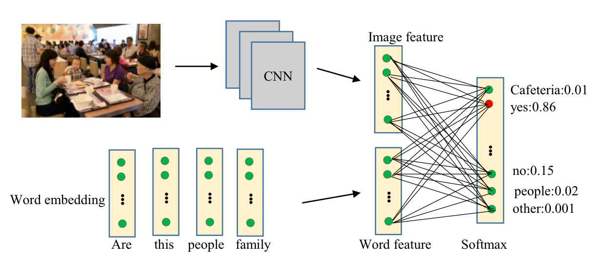
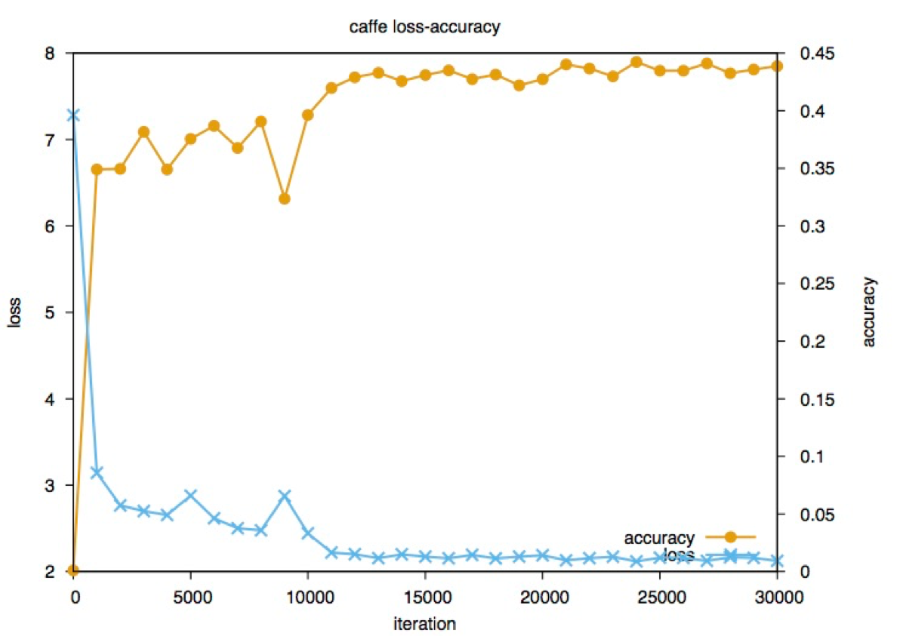
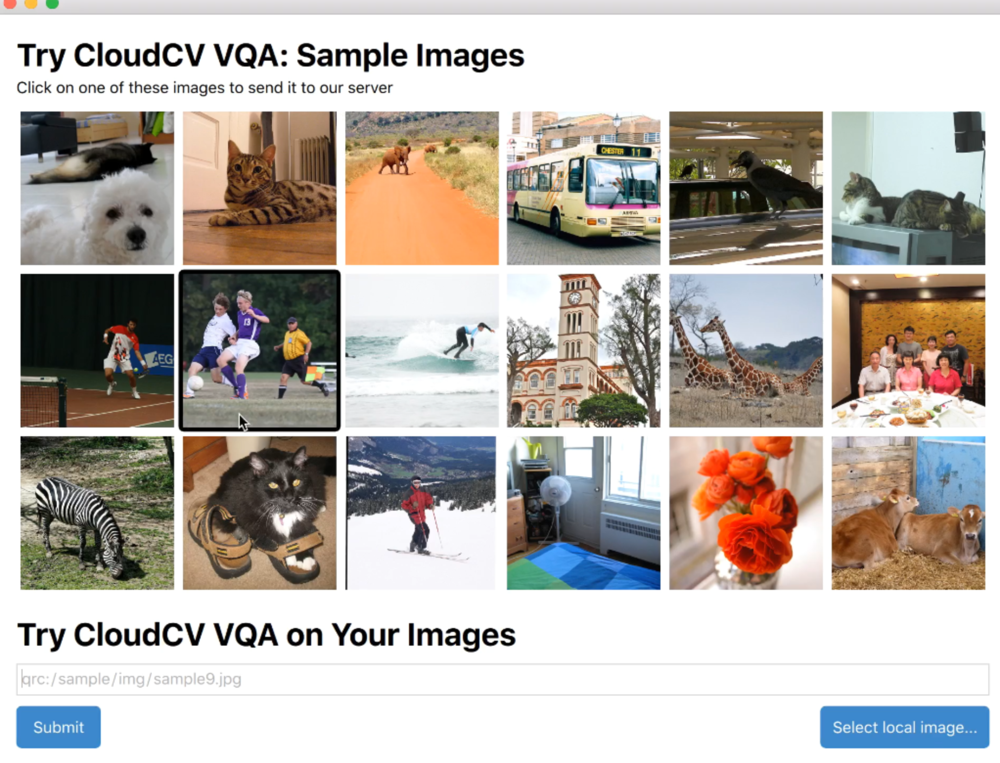
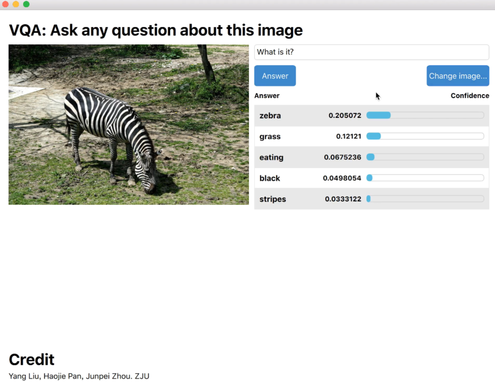
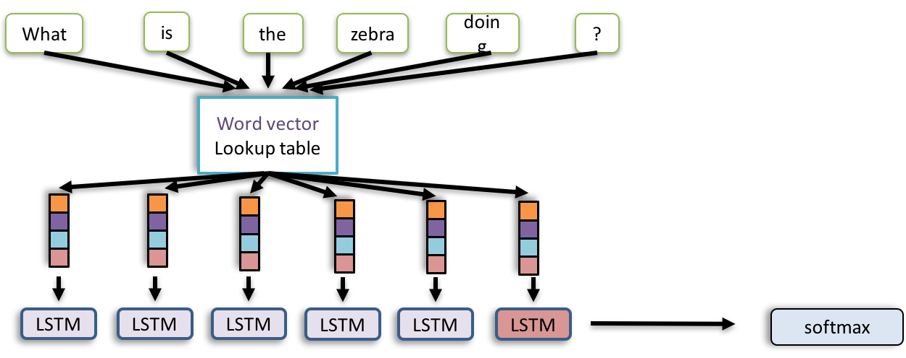
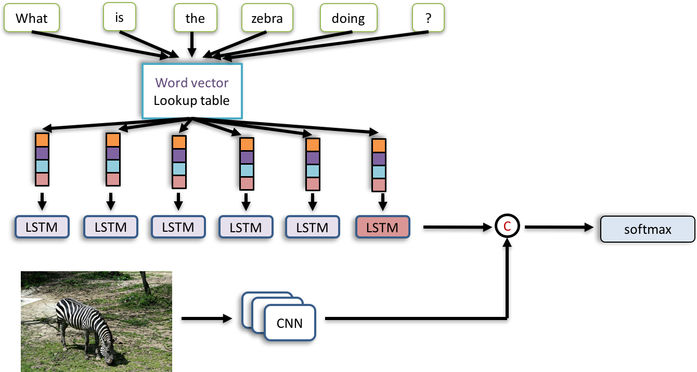
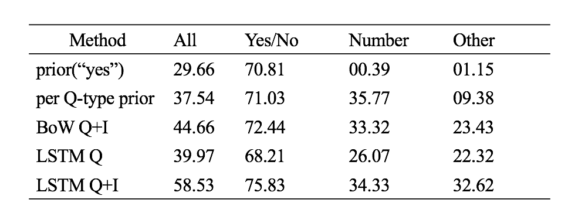

# VisualQA
Visual Question Answer system

#### 2016/4 Our first baseline model
* based on this [paper]("http://arxiv.org/pdf/1512.02167.pdf") from MIT
* The model is as below:
  

  
* And our training curve:
  

  

#### 2016/7 Demo based on our first model
  

[Here](http://o6qr23o6z.bkt.clouddn.com/demo.mp4) is demo video
  
#### 2016/8 New model using LSTM
* LSTM to train question, and without image information
  

  
* LSTM to train question, and add image information
  

#### 2016/9 Testing results:

